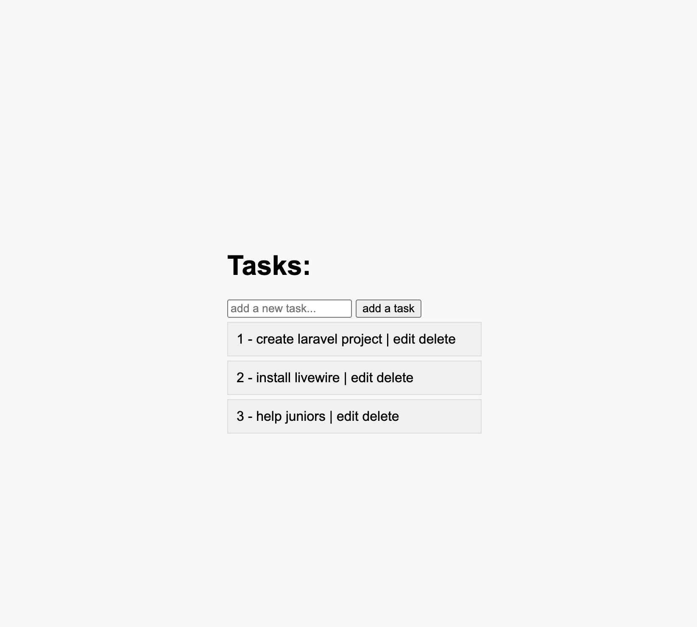

# Task Management

1. **Migrate Database or Use Backup**

     ```bash
     php artisan migrate
     ```
     ```bash
     mysql -u user -p db < database.sql
     ```

2. **Start the Server**
   ```bash
   php artisan serve


# Example

